<!-- ═══════════════════════════════════════════════════════════ -->
<!-- HEADER WITH 3D ANIMATED BACKGROUND                        -->
<!-- ═══════════════════════════════════════════════════════════ -->

<!-- 3D Animated Background SVG (Portrait) -->

<!-- ─── CONTENT OVERLAY ─── -->

<!-- TYPING HEADER -->

 

  <i>Architecting Decentralized Intelligence, LLM Pipelines & Computer Vision Models</i>

 

<!-- SOCIAL LINKS -->

&nbsp;

&nbsp;

&nbsp;

&nbsp;

  

