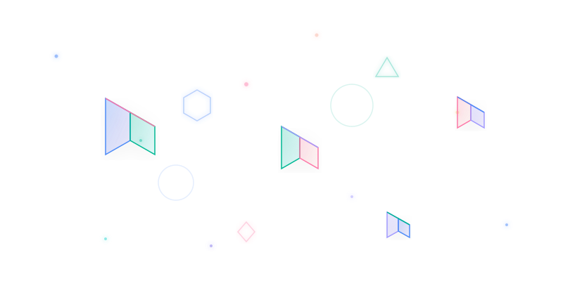

<!-- ═══════════════════════════════════════════════════════════ -->
<!-- HEADER WITH 3D ANIMATED BACKGROUND                        -->
<!-- ═══════════════════════════════════════════════════════════ -->

<!-- 3D Animated Background SVG (Portrait) -->

<!-- ─── CONTENT OVERLAY ─── -->

<!-- TYPING HEADER -->

 

  <i>Architecting Decentralized Intelligence, LLM Pipelines & Computer Vision Models</i>

 

<!-- SOCIAL LINKS -->

&nbsp;

&nbsp;

&nbsp;

&nbsp;

  

&nbsp;

&nbsp;

<!-- ═══════════════════════════════════════════════════════════ -->
<!-- TECHNICAL ECOSYSTEM                                        -->
<!-- ═══════════════════════════════════════════════════════════ -->

<h3>⚡ TECHNICAL ECOSYSTEM</h3>

 

<!-- ─── CARD 1: AI/ML ─── -->

  ◆ AI / MACHINE LEARNING

 

  
  
  

  NLP · Computer Vision · LLMs

 

<!-- ─── CARD 2: LANGUAGES ─── -->

  ◈ LANGUAGES & DATA

 

  
  
  
  

 

<!-- ─── CARD 3: WEB ─── -->

  ◇ WEB & SYSTEMS

 

  
  
  
  

 

<!-- ─── CARD 4: MLOPS ─── -->

  ◉ MLOPS & INFRASTRUCTURE

 

  
  
  
  
  
  

 

 

<!-- ─── DIVIDER ─── -->

 

<!-- ═══════════════════════════════════════════════════════════ -->
<!-- REPOSITORIES                                               -->
<!-- ═══════════════════════════════════════════════════════════ -->

<h3>◆ ACTIVE REPOSITORIES</h3>

 

  
  
  
  
  

  

<!-- ═══════════════════════════════════════════════════════════ -->
<!-- FOOTER                                                    -->
<!-- ═══════════════════════════════════════════════════════════ -->

  

  <b style="color: #58a6ff;">@SANAULLAH-AI</b> &nbsp;•&nbsp; AI/ML Researcher &nbsp;•&nbsp; Islamabad, Pakistan

