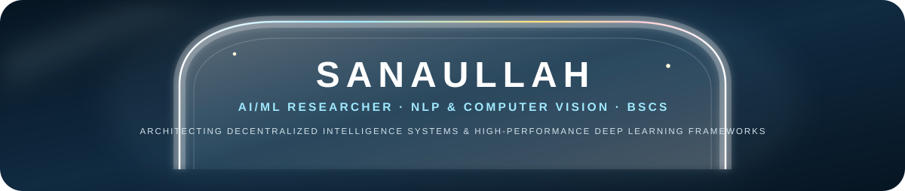

 

  <b>AI/ML Researcher</b> &nbsp;|&nbsp;
  <b>NLP &amp; Computer Vision</b> &nbsp;|&nbsp;
  <b>BSCS @ Abasyn University</b>
   
  <i>Architecting Decentralized Intelligence Systems &amp; High-Performance Deep Learning Frameworks</i>

<table width="100%">
<tr>
<td align="center">

<a href="https://www.linkedin.com/in/sanaullah-ai"><b>LINKEDIN</b></a>
&nbsp;•&nbsp;
<a href="https://sanaullah-portfolio.onrender.com/"><b>PORTFOLIO 1</b></a>
&nbsp;•&nbsp;
<a href="https://sanaullah7964.netlify.app"><b>PORTFOLIO 2</b></a>
&nbsp;•&nbsp;
<a href="https://huggingface.co/sanaullah7964"><b>HUGGING FACE</b></a>
&nbsp;•&nbsp;
<a href="https://www.kaggle.com/sanaullah03041417973"><b>KAGGLE</b></a>
&nbsp;•&nbsp;
<a href="mailto:sanaullah786shah92@gmail.com"><b>EMAIL</b></a>

</td>
</tr>
</table>

 

<table width="100%">
<tr>
<td align="left">

### TECHNICAL ECOSYSTEM

**Artificial Intelligence &amp; Frameworks**

  

**Data Analytics &amp; Scientific Computing**

  

**Web Engineering &amp; Systems**

  

**Infrastructure &amp; Research Tools**

</td>
</tr>
</table>

 

